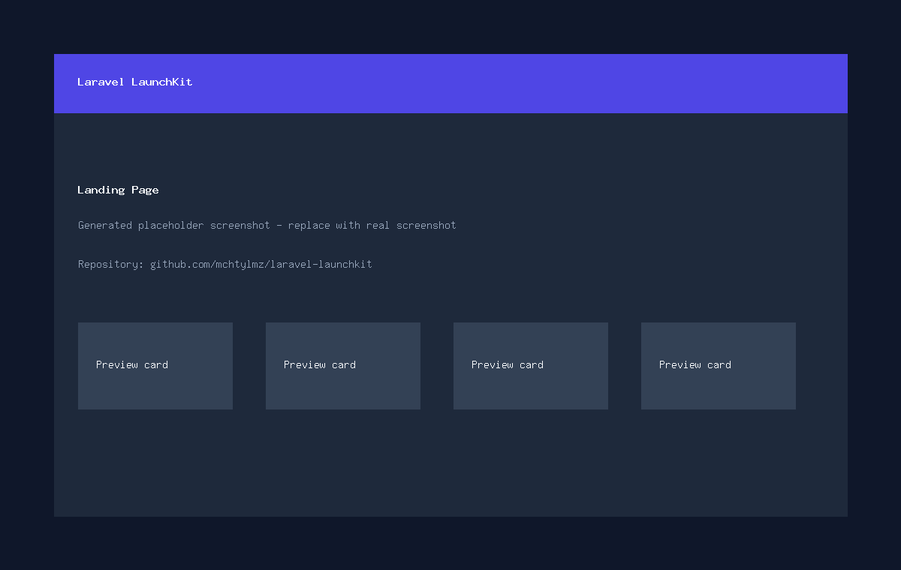
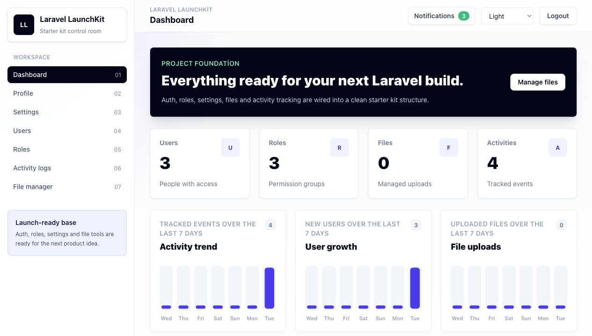
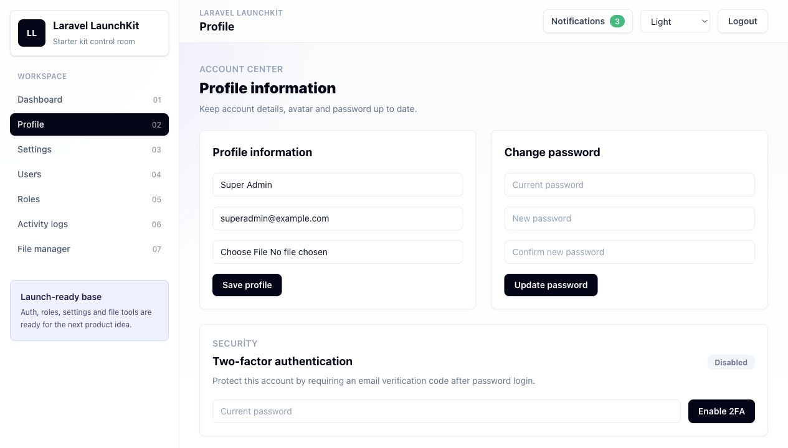
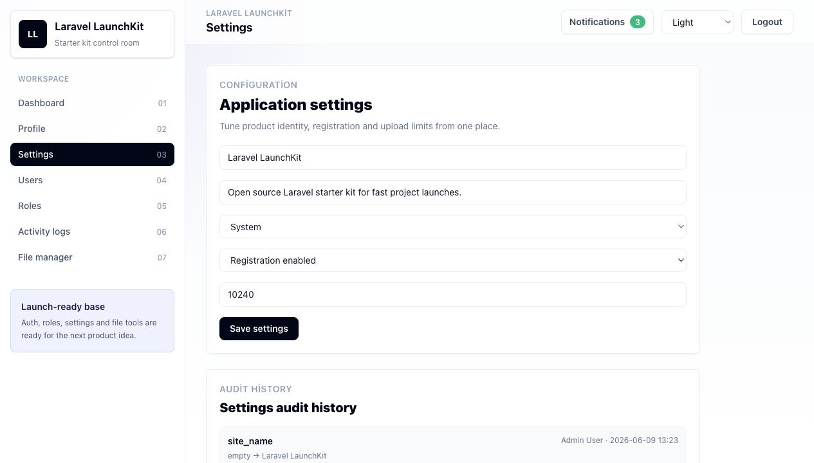
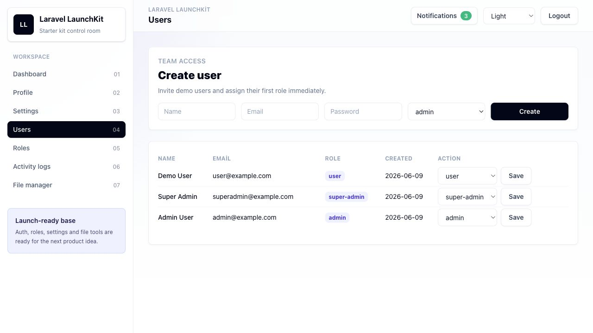
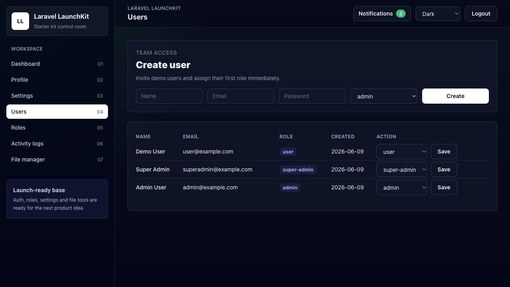

# Laravel LaunchKit

Laravel LaunchKit; modern dashboard, auth sistemi, roller, ayarlar, activity log ve basit dosya yöneticisiyle yeni Laravel projelerine hızlı başlamak için hazırlanmış açık kaynak bir starter kit projesidir.

**GitHub proje adı:** Laravel LaunchKit  
**GitHub repository slug:** `laravel-launchkit`  
**Repository URL:** https://github.com/mchtylmz/laravel-launchkit

## Bu Proje Neden Var?

Laravel projelerinin çoğunda benzer temel ihtiyaçlar bulunur: giriş/kayıt, profil yönetimi, rol ve izinler, ayarlar, kullanıcı arayüzü, işlem kayıtları ve temel dosya yönetimi. Laravel LaunchKit bu parçaları ağır bir admin panel bağımlılığı olmadan, sade ve okunabilir bir kod tabanında sunar.

## Özellikler

- Auth sistemi: login, register ve logout
- Kullanıcı profil sayfası
- Şifre değiştirme
- Avatar yükleme
- Role ve permission altyapısı
- Ayarlar sayfası
- Dark mode
- Responsive sidebar
- Notification dropdown
- Kalıcı notification kayıtları ve okundu işaretleme
- Activity log
- Activity log arama ve filtreleme
- Basit dosya yöneticisi
- Dashboard istatistik kartları
- Dashboard mini grafik kartları
- İki aşamalı doğrulama
- Ayarlar değişiklik geçmişi
- Demo kullanıcı seedleri

## Kullanılan Teknolojiler

- Laravel 13
- PHP 8.4+
- Varsayılan SQLite veritabanı
- Vite
- TailwindCSS
- Alpine.js
- Spatie Laravel Permission
- Spatie Laravel Activitylog
- Laravel Pint

## Kurulum

### Lokal Kurulum

```bash
git clone https://github.com/mchtylmz/laravel-launchkit.git
cd laravel-launchkit
composer install
npm install
cp .env.example .env
php artisan key:generate
touch database/database.sqlite
php artisan storage:link
php artisan migrate:fresh --seed
npm run build
```

Projeyi lokal olarak çalıştırın:

```bash
php artisan serve
```

Frontend geliştirme için:

```bash
npm run dev
```

### Docker ile Kurulum

Servisleri oluşturup başlatın:

```bash
docker compose up -d --build
```

Yeni klonlanan projede PHP bağımlılıklarını app container içinde kurun:

```bash
docker compose exec app composer install
```

Frontend bağımlılıklarını kurup build alın:

```bash
docker compose run --rm node npm install
docker compose run --rm node npm run build
```

Uygulamayı hazırlayın:

```bash
docker compose exec app cp .env.example .env
docker compose exec app php artisan key:generate
docker compose exec app php artisan storage:link
docker compose exec app php artisan migrate:fresh --seed
```

Uygulamayı açın:

```text
http://localhost:8000
```

## Ortam Değişkenleri

Proje varsayılan olarak SQLite ile çalışır.

```env
APP_NAME="Laravel LaunchKit"
APP_URL=http://localhost:8000
DB_CONNECTION=sqlite
```

Docker için `docker-compose.yml` içindeki MySQL servis değerlerini kullanın:

```env
DB_CONNECTION=mysql
DB_HOST=mysql
DB_PORT=3306
DB_DATABASE=laravel_launchkit
DB_USERNAME=launchkit
DB_PASSWORD=secret
REDIS_HOST=redis
MAIL_HOST=mailpit
MAIL_PORT=1025
```

SQLite veritabanı dosyasının olduğundan emin olun:

```bash
touch database/database.sqlite
```

## Migration ve Seed Komutları

```bash
php artisan migrate:fresh --seed
```

## Demo Kullanıcı Bilgileri

| Rol | E-posta | Şifre |
| --- | --- | --- |
| Super Admin | superadmin@example.com | password |
| Admin | admin@example.com | password |
| User | user@example.com | password |

## Kullanım Örnekleri

Laravel geliştirme sunucusunu başlatın:

```bash
php artisan serve
```

Frontend geliştirme sunucusunu başlatın:

```bash
npm run dev
```

Production frontend dosyalarını oluşturun:

```bash
npm run build
```

Kod formatını düzeltin:

```bash
./vendor/bin/pint
```

## Ekran Görüntüleri

Bu ekran görüntüleri Laravel LaunchKit arayüzünün güncel halini gösterir.








## Yol Haritası

- E-posta doğrulama ekleme
- Şifre sıfırlama e-postalarını ekleme
- Daha gelişmiş notification kaydı
- Dosya önizleme
- Browser testleri
- Docker production notlarını geliştirme

## Katkı Sağlama

Katkılar kabul edilir. Değişikliklerin küçük, okunabilir ve sade Laravel starter kit amacına uygun olması beklenir.

## Lisans

Bu proje MIT lisansı ile açık kaynak olarak paylaşılır.

## Geliştirici

Mucahit Yilmaz tarafından geliştirilmiştir.

LinkedIn: https://www.linkedin.com/in/mmucahityilmazz/
